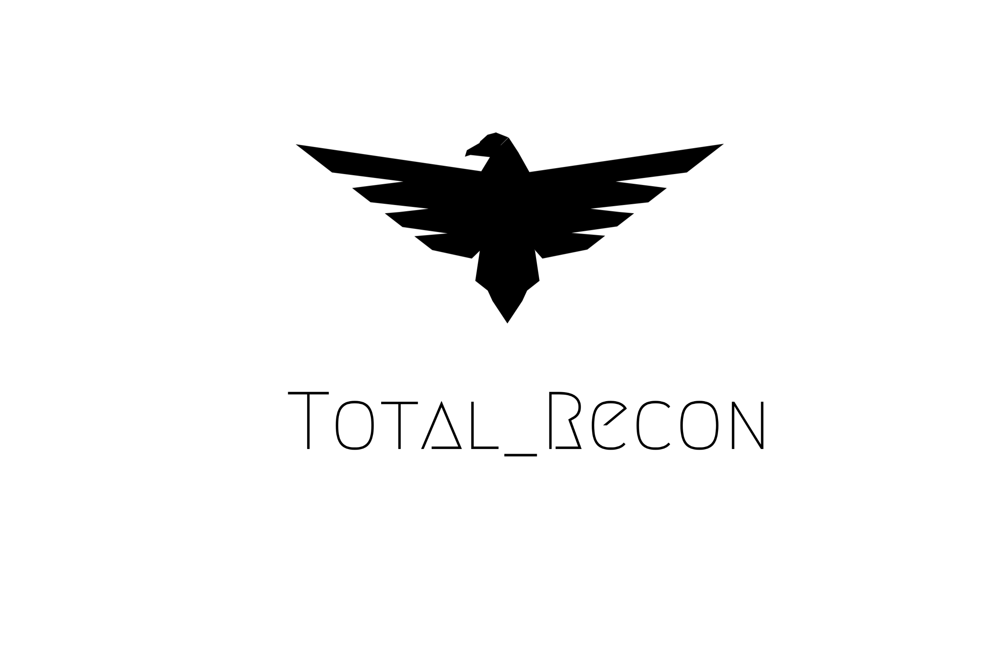

## Script And methodologies for Recon 

1.[Wreck.sh](./wreck.sh)
> Creates 12 files by filtering Domains and Subdomains

2.[cors.sh](./cors.sh)
> Check if the domain has CORS misconfiguration

3.[certs.sh](./certs.sh)
> Checks for Certificates 

